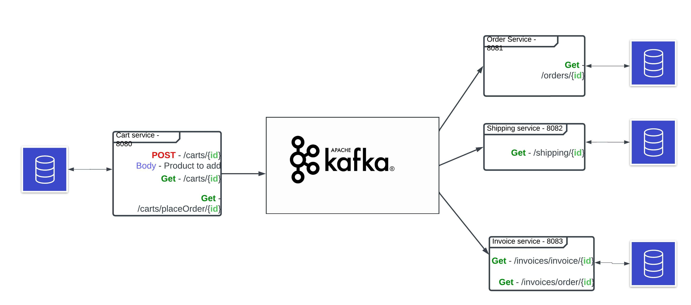
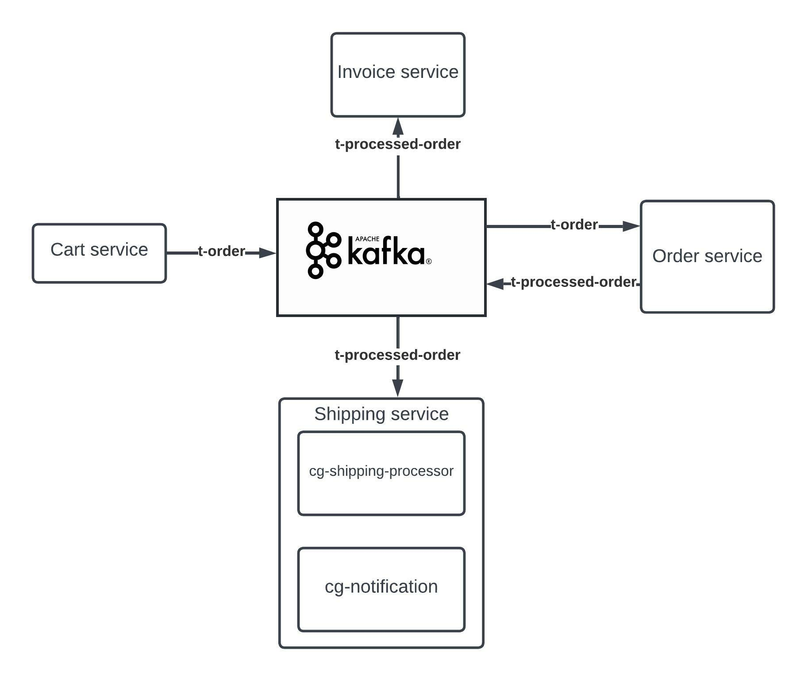

# Overview:
The application consists of four servies 
- Cart service - which will expose rest endpoints to add product to cart, view products in cart and place order.
- Order service - expose rest endpoints to view the order details.
- Shipping service -  exposes rest endpoints for shipping details of the processed orders and sends notification to customers.
- Invoice service - maintains the invoice details of the processed orders.
- **Each service will use kafka as a middleware.**

## Functionalities:
### Cart service
- Expose rest endpoints to add products to cart
- Expose rest endpoints to place order
- Publish placed order to t-order kafka topic.
### Order service
- Expose rest endpoint to view order
- Consume order messages by listening to t-order kafka topics.
- Publish processed orders to t-processed-order topic
- 
### Shipping service
- Expose rest endpoints to view shipping details
- Consume order message by listening to t-processed-order topic.
- Multiple consumer groups of shipment processing and notification service.
### Invoice service
- Expose rest endpoints to manage invoices.
- Consume order message by listening to t-processed-order topic.
## Software requirements:
- Java - 11
- Gradle 7.5
- Spring boot 2.7.3
- Kafka 2.13
- H2 database used for simplicity

# Note:
- Start kafka server and Create kafka topics using the following commands before running the application
```ruby
zookeeper-server-start.bat ../../config/zookeeper.properties
```
```ruby
kafka-server-start ../../config/server.properties
```
```ruby
.\kafka-topics.bat --bootstrap-server localhost:9092 --create --topic t-processed-order --replication-factor 1 --partitions 3
```
